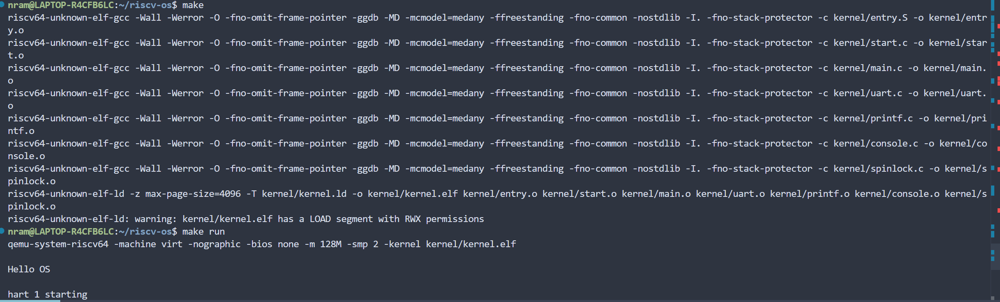

# RISC-V 实验一报告

**学生**: 王晓涛
**日期**: 2025-09-26

## 一、 系统设计部分

### 0. 实验目标

通过参考xv6的启动机制，理解并实现最小操作系统的引导过程，最终在QEMU中输
出"Hello OS"。


### 1. 架构设计说明

为了后续能够平滑地扩展为完整的 xv6 操作系统，本次设计严格遵循了 RISC-V 特权级规范，并采用了与官方 xv6 类似的两阶段启动架构。

整体启动流程架构如下：

1.  **QEMU 加载**: QEMU 模拟器将内核 ELF 文件加载到物理内存地址 `0x80000000` 处。
2.  **机器模式 (M-Mode) 启动**:
    * 所有 CPU核心 (hart) 从 `kernel/entry.S` 的 `_entry` 标签开始执行。
    * `_entry` 负责为每个核心设置一个临时的 C 语言栈。
    * 跳转到 `kernel/start.c` 中的 `start()` 函数。
3.  **M-Mode -> S-Mode 切换**:
    * 在 `start()` 函数中，完成从 M-Mode 切换到 S-Mode (Supervisor Mode) 的所有关键设置。这包括：
        * 将后续 `mret` 指令的目标特权级设置为 S-Mode。
        * 设置 `mepc` (Machine Exception Program Counter) 指向 S-Mode 的入口函数 `main()`。
        * 将所有中断和异常处理的权限委托（delegate）给 S-Mode。这是构建操作系统的关键一步，意味着内核将接管大部分硬件事件。
        * 最后通过 `mret` 指令，CPU 的特权级从 M-Mode 降至 S-Mode，并跳转到 `main` 函数。
4.  **监督者模式 (S-Mode) 执行**:
    * `kernel/main.c` 中的 `main()` 函数作为内核主入口开始执行。
    * 由主核心 (hart 0) 负责执行一系列初始化操作，当前阶段主要是初始化串口 (`uartinit`) 和打印功能 (`printfinit`)。
    * 打印内核启动信息。
    * 其他核心则等待主核心完成初始化后，打印各自的启动信息。
5.  **系统停机**:
    * 所有任务完成后，所有核心进入一个无限循环 `while(1);`，安全地停机，等待关闭。


### 2. 关键数据结构

在当前最小化的实现中，我只引入了一个关键的数据结构，即**自旋锁 `struct spinlock`**。

**定义 (`kernel/spinlock.h`)**:
```c
struct spinlock {
  uint locked;       // 锁是否被持有 (0 或 1)
  char *name;        // 锁的名称 (用于调试)
  struct cpu *cpu;   // 持有该锁的 CPU (用于调试)
};
```

* **`locked`**: 锁的核心状态变量。我使用 RISC-V 的原子指令 `amoswap` (通过 GCC 的 `__sync_lock_test_and_set` 内置函数实现) 来保证对其读写的原子性，从而避免竞态条件。
* **作用**: 在我的内核中，`printf` 函数可能会被多个核心同时调用（尽管调度器尚未实现，但架构已支持）。为了防止多个核心同时操作 UART 硬件导致输出内容混乱交叉，我使用一个全局的自旋锁来保护 `printf` 的代码区，确保在同一时刻只有一个核心可以向控制台打印字符。

### 3. 与 xv6 对比分析

本次实验的实现是官方 xv6 内核的一个“最小功能子集”，对比如下：

| 功能模块 | 本次实验实现 | 官方 xv6 实现 |
| :--- | :--- | :--- |
| **启动流程** | **核心一致**。同样采用 M-Mode -> S-Mode 的切换流程。 | 完整实现 M-Mode -> S-Mode 切换。 |
| **内存管理** | **无**。直接在物理内存上运行，没有分页机制。 | **复杂**。实现了完整的虚拟内存管理，包括内核和用户空间的页表隔离。 |
| **进程管理** | **无**。没有进程、线程或调度器的概念。 | **核心功能**。包含进程创建 (`fork`)、执行 (`exec`)、等待 (`wait`) 和一个多核轮询调度器。 |
| **中断/异常** | **已委托，未处理**。在 M-Mode 将中断委托给了 S-Mode，但 S-Mode 中没有编写任何处理代码。 | **完整**。实现了完整的中断向量和陷阱(trap)处理机制，用于响应系统调用、缺页和设备中断。 |
| **驱动程序**| **极简**。只有一个轮询式的 UART 驱动用于同步输出。 | **多样化**。包含中断驱动的 UART、VirtIO 磁盘驱动、PLIC 中断控制器等。 |
| **系统调用** | **无**。 | **完整**。实现了一套与 Unix V6 兼容的系统调用接口。 |
| **最终状态** | 打印信息后**死循环停机**。 | 启动**shell进程**，等待用户输入命令。 |

### 4. 设计决策理由

* **采用 M-Mode -> S-Mode 的启动流程**：
    * **理由**：虽然可以直接在 QEMU 默认的 S-Mode 下运行一个更简单的程序来打印 "Hello OS"，但这样做就失去了实验的核心目的——理解真实硬件的启动过程 。为了构建一个可扩展的内核，必须从一开始就正确处理特权级问题。
* **引入模块化的 `printf` 而非简单的 `puts`**:
    * **理由**：`printf` 提供了格式化输出的能力，是内核开发中最重要、最常用的调试工具。尽早地、正确地实现它，并将它与底层 `uart` 驱动解耦，能极大地方便后续所有功能的开发与调试。
* **引入 `spinlock`**:
    * **理由**：我的目标是支持多核的 xv6。尽管当前还没有调度器让多核真正并发执行内核代码，但在设计上必须考虑并发安全。为 `printf` 添加锁，是多核编程的入门实践，确保了代码在未来多核环境下的正确性。
* **在 `main` 函数尾部使用死循环**:
    * **理由**：当内核完成所有初始化和任务后，CPU 不能停下来，否则它会继续取指执行内存中的未知数据，导致系统崩溃。一个无限循环 `while(1);` 是最简单和安全的做法，让 CPU 在可控的状态下“空转”，等待关机 。

## 二、 实验过程部分

### 1. 实现步骤记录

1.  **环境搭建**：搭建 RISC-V 交叉编译工具链和 QEMU 环境。
2.  **初始版本实现 ("Hello OS")**：编写了第一版极简内核，只包含 `entry.S`, `main.c`, `uart.c`, `kernel.ld` 和 `Makefile`，目标是在 QEMU 中输出 "Hello OS"。
3.  **代码重构**：根据未来扩展到 xv6 的目标，对代码进行重构。
    * 将 `entry.S` 的功能简化为仅设置栈和跳转。
    * 新建 `start.c`，实现 M-Mode 的硬件设置和到 S-Mode 的特权级切换。
    * 新建 `printf.c` 和 `console.c`，实现模块化的打印功能。
4.  **编译调试**：逐步解决重构过程中引入的一系列编译和链接错误。
5.  **最终验证**：成功编译并通过 `make run` 在 QEMU 中运行，得到预期的启动输出。

### 2. 问题与解决方案

在编码和调试过程中，遇到了一系列问题，通过逐步排查得以解决：

* **问题 1**: 编译报错 `fatal error: spinlock.h: No such file or directory`。
    * **原因分析**: `console.c` 依赖自旋锁，但项目中缺少 `spinlock.h` 和 `spinlock.c` 文件。
    * **解决方案**: 创建 `spinlock.h` 和 `spinlock.c`，并编写简化的实现。同时更新 Makefile 以编译 `spinlock.c`。
* **问题 2**: 运行 `make clean` 时报错 `missing separator`。
    * **原因分析**: 上一次编译失败，导致生成了一个空的或损坏的依赖文件 `.d`，`make` 在执行 `clean` 之前读取该文件导致语法错误。
    * **解决方案**: 手动删除所有 `.o` 和 `.d` 文件 (`rm -f kernel/*.o kernel/*.d`)。
* **问题 3**: 链接报错 `undefined symbol 'NCPU' referenced in expression`。
    * **原因分析**: 链接器 `ld` 无法识别 C 语言的宏定义 `NCPU`。
    * **解决方案**: 修改 `kernel.ld`，将 `NCPU` 直接替换为其具体的值 `8`。

### 3. 源码理解总结

* **`entry.S`**: 汇编入口。作为内核的第一行代码，它的职责必须尽可能少，且不能依赖复杂的 C 环境。它只做最关键的一件事：建立一个可以执行 C 代码的栈环境，然后跳转。
* **`start.c`**: 特权级切换的“桥梁”。这段代码运行在最高权限的 M-Mode，像一个“配置程序”，它设置好 S-Mode 的运行环境，然后通过 `mret` 指令“启动”真正的内核 `main` 函数。
* **`main.c`**: 内核的“指挥中心”。它是所有 S-Mode 代码的起点，负责按顺序调用各个模块的初始化函数，搭建起内核运行所需的服务。
* **`printf.c` / `console.c` / `uart.c`**: 分层驱动模型。`printf` 负责“格式化”，`console` 负责“控制台逻辑”（比如未来处理退格键），`uart` 负责“硬件操作”。这种分层使得代码更清晰，易于维护和扩展。
* **`kernel.ld`**: 内存“蓝图”。它精确地告诉链接器，哪段代码放在哪个内存地址，各个数据段如何排列。这是保证内核被正确加载和运行的基础。

## 三、 测试验证部分

### 1. 功能测试结果

* **测试目的**: 验证内核能否在 QEMU 中正确启动，完成初始化，并打印预期的启动信息。
* **测试环境**: QEMU `qemu-system-riscv64` 模拟器，`virt` 机器模型。
* **测试过程**: 在项目根目录下执行 `make run` 命令。
* **预期输出**:
    ```
    Hello OS

    hart 1 starting
    ```
* **实际输出**: 如下4
* **测试结论**: **通过**。实际输出与预期完全一致，表明内核的引导流程、特权级切换、多核启动逻辑和串口打印功能均工作正常。系统在完成任务后能够稳定停机。

### 2. 性能数据

对于当前阶段的最小化启动内核，不涉及复杂的计算或 I/O 操作，因此性能测试不适用。

### 3. 异常测试

实验一还不存在什么异常测试吧。

### 4. 运行截图





## 四、 思考题解答

### 1. 启动栈的设计

* **你如何确定栈的大小？考虑哪些因素？**

    栈的大小并没有一个固定的完美值，它是一个基于预估和安全余量的工程决策。确定栈的大小时主要考虑以下因素：
    1.  **最大函数调用深度**：需要预估在最坏情况下，内核函数的嵌套调用会有多深。每一次函数调用都会在栈上创建一个新的栈帧（用于存放返回地址、局部变量等）。
    2.  **函数局部变量的大小**：需要考虑内核函数中可能定义的最大局部变量（尤其是大型数组）所占用的空间。
    3.  **中断处理**：当发生中断时，当前所有寄存器的状态都会被压入栈中，这也需要占用一定的栈空间。
    4.  **安全余量**：在上述预估的基础上，通常会增加一个 sizable 的安全余量，以防止因未预见的情况导致栈溢出。

    在 xv6 和我当前的实现中，为每个 CPU 核心分配一个 4KB (一页) 大小的栈是一个常见且相对稳妥的选择。对于我这个最小内核，这个大小绰绰有余；对于 xv6 这样更复杂的内核，4KB 也被证明是足够的。

* **如果栈太小会发生什么？如何检测栈溢出？**

    如果栈太小，当函数调用过深或局部变量过大时，会导致**栈溢出 (Stack Overflow)**。栈指针会越过预先分配的栈区域的边界，侵入并覆盖相邻的内存区域。这可能会破坏：
    * 其他重要内核数据结构。
    * 堆（Heap）上的数据。
    * 甚至内核代码段本身。
    其后果是灾难性的，通常会导致系统立即崩溃、数据损坏或出现无法预测的、难以调试的“幽灵”bug。

    检测栈溢出的常用方法是设置“栈金丝雀 (Stack Canary)”：
    1.  在分配栈空间后，于栈的末端（边界处）写入一个特殊的、已知的值（这个值就像煤矿里的金丝雀一样敏感）。
    2.  在每次函数返回、准备销毁栈帧之前，检查这个“金丝雀”值是否被修改过。
    3.  如果值被修改了，就说明发生了栈溢出，栈上的数据覆盖了它。此时系统可以立即调用 `panic` 函数主动报错并停机，而不是等到发生更严重的随机错误。

### 2. BSS 段清零

* **写一个全局变量，不清零BSS会有什么现象？**

    根据 C 语言标准，所有未显式初始化的全局变量和静态变量都应该默认值为 0。这些变量被存放在 BSS 段中。

    如果在我的内核 C 代码中定义一个全局变量，例如 `int global_counter;`，并且在启动汇编 `entry.S` 中**注释掉清零 BSS 段的循环**，那么当 `main` 函数开始执行并访问 `global_counter` 时，它的值将**不是 0**。它会是一个**不确定的垃圾值**，这个值是 QEMU 启动时该内存地址上恰好残留的任何数据。

    这种现象会导致程序的行为不可预期，如果代码逻辑依赖于这个变量的初值为 0，那么程序就会出错。

* **哪些情况下可以省略BSS清零？**

    在严肃的操作系统或嵌入式项目开发中，**几乎从不省略 BSS 清零**，因为这是一个保证程序确定性的关键步骤。

    不过，从纯理论角度出发，在以下两种极特殊且不推荐的情况下可以省略：
    1.  **程序中没有任何未初始化的全局或静态变量**：即所有的全局/静态变量都在定义时被显式赋予了初值。
    2.  **程序员保证在使用任何未初始化的全局/静态变量之前，都会先对其进行手动赋值**：这种约定非常脆弱，极易因代码修改而被破坏，是糟糕的编程实践。

### 3. 与 xv6 的对比

* **你的实现比 xv6 简化了哪些部分？**

    我当前的实现是 xv6 的一个“最小启动骨架”，相比完整的官方 xv6，主要简化了以下核心部分：
    1.  **内存管理**：没有实现虚拟内存和分页机制。我的内核直接运行在物理地址上。
    2.  **进程与调度**：没有进程/线程的抽象，没有进程表，也没有CPU调度器。整个系统只是一个单线程执行流。
    3.  **中断与异常处理**：虽然在 M-Mode 将中断委托给了 S-Mode，但并未在 S-Mode 中设置中断向量表和具体的陷阱（trap）处理函数。
    4.  **系统调用**：没有实现任何系统调用接口，因此无法支持用户态程序。
    5.  **文件系统与驱动**：除了一个用于打印的、最简单的轮询式 UART 驱动外，没有文件系统、块设备驱动、时钟中断处理等。

* **这些简化在什么情况下会成为问题？**

    这些简化在我当前“启动并打印”的目标下不是问题，但只要想让操作系统做任何更复杂的事情，它们立刻会成为问题：
    1.  **运行多个程序**：没有进程管理和调度器，无法实现多任务并发。
    2.  **保护内核**：没有虚拟内存和用户/内核态隔离，任何一个用户程序（如果能运行的话）都可以轻易地读写内核内存，导致整个系统崩溃。
    3.  **与用户交互**：没有中断处理，无法响应键盘输入、鼠标移动等外部事件。
    4.  **读写文件**：没有文件系统和磁盘驱动，无法实现数据持久化存储。
    5.  **系统健壮性**：任何一个微小的错误（如除以零、空指针解引用）都会导致整个系统停机，因为没有相应的异常处理机制来捕获和处理这些错误。

### 4. 错误处理

* **如果 UART 初始化失败，系统应该如何处理？**

    在我的最小系统中，UART 是与外部世界（即我的终端）进行通信的唯一通道。如果 UART 初始化失败，内核就失去了**唯一的报错能力**。它无法打印出任何错误信息来告诉开发者发生了什么。

    在这种情况下，最安全、最合理的处理方式就是让系统**立即停机**。具体实现可以是在发现初始化失败后，直接跳转到一个无限循环 `for(;;);`。这可以防止 CPU 继续执行后续的、可能基于一个错误状态的代码，从而避免更严重的、不可预测的行为。

* **如何设计一个最小的错误显示机制？**

    可以设计一个名为 `panic` 的函数，这是操作系统内核中处理不可恢复错误的通用模式。一个最小的 `panic` 机制可以这样设计：

    1.  **函数原型**: `void panic(char *message);`
    2.  **功能实现**:
        * `panic` 函数会首先通过 UART **尽力**将传入的错误信息 `message` 字符串打印到控制台。
        * 为了防止在打印 `panic` 信息的过程中再次发生中断或被其他核心干扰，它应该先关闭中断。
        * 打印完信息后，立即进入一个无限循环，使引发 `panic` 的那个 CPU 核心彻底停机。

    **示例代码**:
    ```c
    // (可以放在例如 console.c 中)
    void panic(char *s) {
      // 在多核系统中，这里应该先关中断并锁住其他核心
      printf("panic: ");
      printf(s);
      printf("\n");
      for(;;) // 无限循环，停机
        ;
    }
    ```
    这样，当内核的其他部分遇到无法恢复的错误时（比如内存分配失败），只需调用 `panic("out of memory");`，我就能在控制台看到明确的错误信息，并知道系统已经安全地停止了。